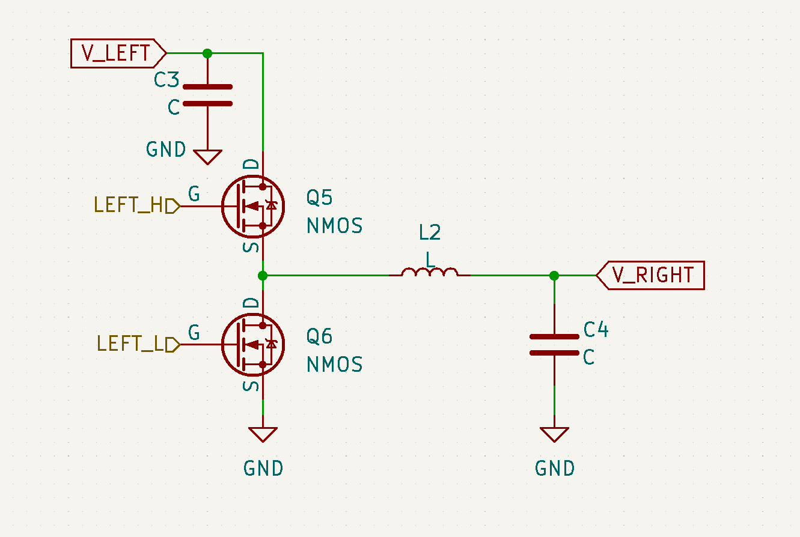

    廉价，可靠，高效

     RM2023香港科技大学ENTERPRIZE

     数控超级电容方案开源

 

# 前言

在Robomaster机甲大师赛事中，严苛的底盘功率限制规则迫使各参赛队伍从软件和硬件方面研究高效的功率管理方案。早在2018年末，大连交通大学TOE战队，桂林电子科技大学Evolution战队与香港科技大学ENTERPRIZE战队等便相继开源了各具特色的超级电容方案。2020年，官方裁判系统超级电容管理模块与相关限制规则加入，超级电容的使用更加规范化，给各战队带来了不小的挑战。

2021赛季末大连理工凌_BUG战队开源了他们基于双向BUCK-BOOST电路构建的超级电容控制模块，引发广泛关注。我队取其精华，在其基础上进行数次迭代，经过一年时间，完成了低成本，稳定可靠的数控超级电容方案。本着技术交流和初心高于胜负的初衷我队现决定将此方案开源。欢迎大家交流学习。

 

# 方案回顾

自2018年超级电容方案诞生以来，其大致电路方案可分为以下3种

1.  电源->恒功率充电模块->超级电容//底盘电机

2. 电源->恒功率充电模块->超级电容->恒压放电模块->底盘电机

3. 电源//底盘电机<->双向可控功率模块<->超级电容

笔者将基于自身理解对这些方案进行简单优缺点分析

## 电源->恒功率充电模块->超级电容//底盘

本方案直接明了，通过恒功率充电模块对整个底盘的输入功率进行控制，并通过超级电容对能量进行缓存。

该方案主要有以下几个优点：

1.   超级电容直接和底盘电机并联，相当于自带了高效的动能回收机制
2.   理想状态下能够保证在任何时候都无法超功率

在充放电的过程中，底盘电机母线电压是随超级电容电压的波动而波动的，因此该方案存在以下几个显著缺点

1.   如果电容电量过低，会导致底盘电机欠压保护，或工作不正常

2.   电压不稳定，会影响底盘电机的控制，具体可表现为相同参数下电机的输出力矩，转速等存在较大幅度波动。

3.   动能回收时，会有较大的倒灌电流涌入电容，对电容组及其保护板的设计有一定的考验。

4.   在机器人阵亡后，若电容仍有余电，底盘电机可能仍有足够电压继续移动一段时间，若不做处理可能违反规则

5.   模块之间串联，若有模块损坏或异常断电，则机器人底盘直接掉电，无法继续移动

 

## 电源->恒功率充电模块->超级电容->恒压放电模块->底盘电机

该方案在上个方案的基础上增加了一个恒压模块，以稳定底盘电机母线电压。

因此，该方案有以下几个优点：

1.   与上个方案一样，理想状态下，底盘不会超功率

2.   在电容电量耗尽前，底盘电机的母线电压相对恒定，能够给电机提供良好的工作环境

由于恒压放电模块可能存在的一些特性，该方案可能存在以下几个缺点：

1.   若恒压放电模块为非同步boost/buckboost或者其控制策略不允许电流倒灌（例如其boost半桥上管采用理想二极管策略控制），则该方案完全无法进行动能回收，且在电机急减速时可能瞬间拉高母线电压，有较大风险烧毁电机（本人亲身体会）

2.   在机器人阵亡后，若电容仍有余电，底盘电机可能仍有足够电压继续移动一段时间，若不做处理可能违反规则

3.   与上个方案一样，模块之间串联，若有模块损坏或异常断电，则机器人底盘直接掉电，无法继续移动。且由于恒压放电模块与底盘电机直接相连，工况较为恶劣，对该模块的设计有较大考验（说白了就是这个如果做的不大行很容易烧，搞不好还不如上一种）。

 

## 电源//底盘电机<->双向可控功率模块<->超级电容

该方案即为本战队本次开源的方案，灵感源自2021赛季大连理工大学凌BUG战队的开源。

在本方案中底盘电机直接连接到电源，超级电容和一个双向可控功率模块共同构成一个可控的功率补偿系统，凭借高速的功率闭环控制动态对底盘功率进行削峰填谷，从而实现超级电容的能量缓冲。

为便于理解，在此举例。

假设底盘功率限制为60W，电池电压为20V，超级电容处于半充满状态。

若此时底盘电机电流为2A，即底盘电机功率为40W，则双向可控功率模块将使用1A电流对超级电容充电，即充电功率为20W。将多余功率缓存在超级电容中。

若此时底盘电机电流为5A，即底盘电机功率为100W，则双向可控功率模块将使用2A电流对超级电容进行放电，此时放电功率为40W。利用超级电容中的能量补偿底盘功率。

若此时底盘电机电流为-2A，即底盘电机功率为-40W，则双向可控功率模块将使用5A电流对超级电容进行充电，此时充电功率为100W。即动能回收的过程。

 

该方案具有如下几个主要优点：

1.   并联接入底盘电机母线，即使系统工作异常，只需要及时切断电路（关断mos管/保险丝熔断等），底盘任可继续正常工作。

2.   无论电容剩余能量如何，底盘电机的母线电压都能保持相对稳定，约等于电源电压，能够给电机提供良好的工作环境。

3.   可以主动限制动能回收的电流，允许部分浪涌电流倒灌回电源，防止损坏超级电容组。

4.   通过简单的代码逻辑，可在底盘电源切断时立即关断系统输出，在机器人阵亡后保存电容能量，同时避免违反规则。

 

该方案的显著缺点如下：

1.   采用数控方案，对嵌入式程序设计，控制系统设计要求较高，稍有不慎即可能损伤硬件。（本人曾脑残将输出电压升至100V以上）

2.   采用并联方式被动补偿功率，若底盘电控不加以合理限制，仍有超功率风险。

 

显然，在参赛队伍硬件实力足够的前提下，第三种方案相较于前两种有极大优势。我们本次开源的方案即基于第三种。

# 电学原理

## 升压与降压

首先回顾经典的升压电路与降压电路。

- Buck降压。下图左侧为非同步Buck电路。而右侧为同步Buck电路，用MOSFET替代了二极管，享受了更低的压降与更灵活的控制。同步Buck电路中，MOSFET经过**控制**，能够在电压正向的时候导通、反向的时候断开，实现了二极管的功能。

    
    
- Boost升压。下图左侧为非同步Boost电路。而右侧为同步Boost电路。用MOSFET替代二极管。

    
    

## 双向升降压

在此处，我们使用对称的双半桥四MOSFET，中间为功率电感，如图。

理想情况下，每个MOSFET都处于完全关闭/完全打开状态。

### 假设电流总是从左流到右：

（这并不是所有情况。但是它有助于理解这个电路的两种形态。）

- 若将RIGHT_H常导通，RIGHT_L常断开，则电路变为如下图。这就是Buck的拓扑，此时将电路看作同步Buck即可实现将左侧电降压后提供给右侧。

    

- 若将LEFT_H常导通，LEFT_L常断开，则电路变为如下图。这就是Boost的拓扑，此时将电路看作同步Boost即可实现将左侧电升压后提供给右侧。

    

- 第三种情况是需要的左电压与右电压相近。此时由于占空比限制，很难使用Buck或者Boost拓扑。于是考虑同时控制两边的半桥，形成buck-boost电路。//todo

### 若电流从右到左

以Buck电路为例，理论上由于电感的伏秒平衡，输出电压的大小由（控制信号的T_on与T_off比值和输入电压）决定。在上文图中便是从V_LEFT输入，V_RIGHT输出。然而，当V_RIGHT被另一个电源拉高至大于Buck电路的理论输出电压，则会产生倒灌现象。

倒灌时，结合电流流向，事实上此时Buck电路被转变为了Boost电路。可以看上图发现两种拓扑是镜像对称的。

因此在控制这个四MOS双向Buck/Boost电路时，实际上**不需要严格区分电路到底是Buck还是Boost**。只不过占空比需要分开计算。

注意：Buck与Boost的互相转换只在 *同步Buck/同步Boost* 中起作用。若在非同步Buck或者非同步Boost上，则会烧坏或击穿元件。

# Features

## 硬件

- 上下板组合

  【图】

  - 上板为FR4四层板，负责控制，带有MCU、MOS驱动、电流采样差分放大器、CAN通信等，以及相应的供电电路。
  - 下板负责功率部分，为铝基板。带有保险丝、MOSFET、扁线电感、固态电容以及采样电阻等，利用铝基板加强散热，使得超级电容控制模块可以持续输出15A大电流而不过热。
  - 上下板通过矮排针排母连接。模块化的设计方便快速更换组件，也方便维修上板或下板。
  - 功率线路从下板直接引出，可将导线焊接在焊盘上，大电流不需要经过上下板连接处，防止因上下板接口烧毁导致的故障发生。

- MOS驱动为UCC27211。采用隔离供电取代UCC27211的自举电容，从而能够实现100%常开上管，显著提高单边Buck/单边Boost的转换效率

  - 通常，UCC27211使用一个自举电容串在引脚HB(BootStrap)与HS(Switching)之间，芯片自带电荷泵，通过浮空自举电容来打开上管。这种做法体积小，但是自举电容需要充电，做不到100%占空比。因此总是工作在buck-boost模式下。考虑到MOS开关时间，损失了较多效率。
  - 此处使用12V->12V DCDC的隔离供电模块。因为隔离供电模块输出电压不稳定，且纹波较大，所以使用RC滤波，并加入TVS(SMAJ10C)来钳位，保护上管。

- 1.65V电压源由运放产生。使用阻容网络补偿，防止驱动容性负载时的环路不稳定。

- 电流采样放大采用INA186差分放大器芯片

  在一众开源方案中，较多使用 INA240 作为电流感应放大器。然而INA240的价格与供应不如人意，在此背景下相关开发人员使用了 INA282 进行替代。但是，INA282 的封装为 SOIC-8，体积大，layout 占用过多空间。其次INA282 最小增益倍数为 50 倍，增益带宽较低，实际测试过程中出现信号失真的问题。 因此经过反复比对选型，最终使用了另一款电流感应放大器 INA186。这款放大器体积小，带宽也能达到标准，耐压能够支持高位采样的需求。但在实际测试过程中发现其对于共模干扰的抑制能力非常差，极易受到开关信号干扰。

  为应对此干扰，在实际电路设计中加入了 RC 滤波电路，截止频率13kHz，实测能够有效过滤共模干扰和电流采样本身的噪音。

  - INA186耐压高达42V，可以实现高位采样
  - 相比常用的INA240，INA186价格优势非常大，能显著节省整体成本
  - INA186的有效带宽20kHz，对于pwm频率约288khz的应用已经足够

- 使用全包裹铝壳，兼顾散热与保护

  【图】

  - 超级电容控制模块效率最高约95%。在处理大电流的情况下，不可避免地产生能量损耗，因而需要将热量导至铝制部件来散热。
  - 对于模块的外壳，我们采用工业化生产的全包裹铝壳。它既充当了散热组件，同时也能屏蔽电磁，防止超级电容控制板的EMI辐射影响敏感部件例如RFID、UWB等。
  - 全包裹铝壳同样有很好的结构强度，在恶劣的使用情况例如翻车、剧烈震荡中可以有效保护内部功率电路。密封的设计也可以防止异物进入，例如打磨产生的铝屑等。这对于超级电容这种储存大能量的模块的安全性而言非常重要。

## MCU外设使用

### MCU选择
  - Buck-Boost电路中，电路性能不变，开关频率越高，则需要的电感大小就越小，产生的成本需求也就小。
  - 我们使用STM32芯片的Timer外设输出开关控制的PWM信号。为了实现精准的占空比控制，时钟周期不能太小；而普通Timer外设的频率一般仅有几十兆赫兹，则开关频率高与时钟周期大无法同时实现。因此我们使用HRTim即高精度时钟外设，内部带有倍频功能，可以达到4.9GHz，实现288KHz的PWM频率同时，也有16000的精度。
  - 带有倍频功能的HRTim的MCU中，能轻松买到的有STM32F334与STM32G474。它们HRTim的功能几乎一样，而STM32G474比STM32F334有更高的主频与内核架构。然而，STM32G474在成本上有很大劣势；同时，代码经过优化之后可以在STM32F334上实现36kHz的闭环。因而我们使用了STM32F334作为该项目的MCU。
### 外设配置
### 时间轴

## 软件

### 控制策略

  - 功率、电压和电流闭环速度为 36kHz，能量闭环速度为 10Hz，通讯频率为 1kHz。
  - 为了实现软启动与无扰切换，我们在电容不开关 MOS 管时，时刻保持内部 HRTIM 的 PWM 占空比 等于两侧电压之比，这使得启动电容的瞬间不会产生巨大的冲击电流。
  - 在具体输出 PID 结果时，我们采用了电压前馈控制，PID 结果在两侧电压之比上进行补偿，有效提升了瞬态响应与控制的线性度。

### 故障处理

  该模块为了保障安全性，设计了数种故障模式，排查了几乎所有会导致灾难性后果的情况。

  - 过压保护

    - 模块会检测电容与底盘的电压，若电压过高，为防止模块本身工作异常导致毁灭性后果，会自动进入锁定状态。
    - 模块认为，任何时刻，AB 电压均不得大于 31V。若检测到超过 31V 的电压，模块会立即进入锁定状态。刹车制动时，底盘电机会将能量倒灌回裁判系统，这些能量的部分会被模块吸收，但当电容充满或倒灌能量过大，电容无力吸收这部分能量，会导致底盘电压升高。为保护底盘电机，防止因模块本身异常导致底盘电机烧毁，模块会检测超过 27V 的底盘电压，若符合一定逻辑，则进入锁定状态，任由能量倒灌回 电池。

    对于底盘输出电压有以下检测逻辑: 

    1. 若底盘电压持续大于 27V 但小于 28V 超过 300ms，则进入过压状态。 
    2. 若底盘电压持续大于 28V 但小于 29V 超过 60ms，则进入过压状态。
    3. 若底盘电压持续大于 29V 但小于 30V 超过 12ms，则进入过压状态。 
    4. 若底盘电压持续大于 30V 但小于 31V 超过 3ms，则进入过压状态。 
    5. 当 A 相电压小于 27V，B 相电压小于 31V，过压锁定自动解除，模块自动尝试重新启动。

  - Buckboost 故障

    - 由于校准误差，代码 bug，局部短路等问题，模块可能会出现升降压部分工作异常的情况，当检测到此部分电路工作异常，模块进入锁定状态，关断输出，且不会自动尝试重新启动，需要用户手动重置。

  - 短路

    - 当模块检测到短路，会立即关断输出，短路状态立即解除，之后模块会尝试重新启动输出。 若短时间内连续检测到多次检测到短路故障，模块认为硬件损坏，不再尝试重新启动输出，需要用户手动重置。

  - 高温

    - 当模块检测到温度过高，会进入高温保护状态，关断输出。 待温度下降后自动恢复，重新启动输出。

  - 裁判系统供电丢失

    - 当模块检测到裁判系统供电丢失时（通常为机器人阵亡），自动关断输出。 待裁判系统供电恢复时，自动尝试重新启动。

  - 电容组故障

    - 当模块检测到超级电容故障，模块进入锁定状态，关断输出，且不会自动尝试重新启动，需要用户手动重置。
    - 检测超级电容故障的逻辑如下：
    - 1. 当超级电容电压变化达到一定阈值时，若充入超级电容的电荷量过低，认为与超级电容之间的连线断开。 （有效电容值过低）
      2. 当充入超级电容的电荷量达到一定阈值时，若超级电容的电压变化过小，认为超级电容局部短路，过充，或漏电。
      3. 为防止电荷量累计漂移误差，若未处于故障状态，每隔一段时间会重置故障检测。

  - 超级电容控制器配合新电容组可以判断正负极性错误

    - 如果正负极接反，电容处于空电状态，会判定为短路，发出短促的嘟嘟嘟提示音。
    - 如果电容正负极接反，且电容处于满电状态插入，将会剧烈打火并烧毁电容控制器下板上对应的tvs或保险丝，从而保护控制部分电路与mos管。此后无论是否接电容，再次给超级电容控制器通电都会发出短促的嘟嘟嘟提示音，需要更换超级电容控制器上的tvs与保险丝

  故障提示及处理

  1. 当超级电容进入任何故障状态后，红灯处于闪烁状态，且同时切断输出，以 200Hz 持续时间 200ms 的低频提示音表示。若此时绿灯亮起，表明超级电容正尝试重新启动，若绿灯不亮，则需要用户手动重置 超级电容模块。重置方法如下： 
  2. 用户可手动断开所有电源连接线，之后再逐个插入，超级电容即重新启动，若顺利通过故障检测， 则故障状态解除。 
  3. 用户可通过 can 发送重启指令，超级电容重新启动，若顺利通过故障检测，则故障状态解除。 
  4. 用户可通过 can 发送关断输出指令，之后再次发送启动输出指令，超级电容会尝试重新启动输出， 若未再次发生故障，正常运行一段时间后故障状态自动解除。

### 附加功能

  - 监测裁判系统供电电压。若常低于某一值（约22V），则认为电池即将耗尽，蜂鸣器响。用来提醒调试人员，防止出现代码未保存的情况。