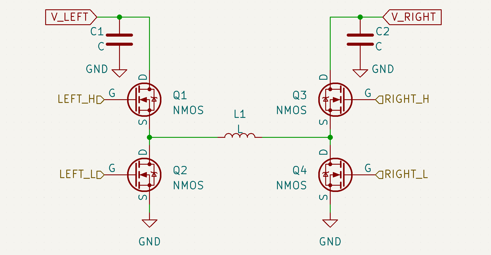

# 前言

"超级电容"指能够在供电线路中（典型值24VDC）吸收、释放电能，以削平供电需求峰，从而使得用电器在一个限制功率的电源下有能力进行爆发式用电。

超级电容一般分为两个部分，控制器模块与电容模块。其中电容模块本体一般是容值较大（约3F）、耐压中等（约30V）的电容组。控制器模块则负责给电容充电、从电容放电等等功能。一般来说，电容模块实现较简单。因此本文主要着重超级电容控制器的实现。

电容控制器一般分为：

- 单向电容控制器：其中电能从电源经过第一个模块处理（如降压）之后进入电容，然后由第二个模块处理（如升压）之后供给用电器。
- 双向buck/boost电容控制器：超级电容并联在总供电线路上。当用电器功率较小时，超级电容吸收电能；用电器功率较大时，超级电容释放电能。使用算法进行闭环，使得超级电容释放的功率能恰好弥补电源供电的不足，从而防止电流被倒灌回电源。

本文聚焦于第二种设计，双向buck/boost电容控制。该设计效率较高，连线简洁。

# 电学原理

## 升压与降压

首先回顾经典的升压电路与降压电路。

- Buck降压。下图左侧为非同步Buck电路。而右侧为同步Buck电路，用MOSFET替代了二极管，享受了更低的压降与更灵活的控制。同步Buck电路中，MOSFET经过**控制**，能够在电压正向的时候导通、反向的时候断开，实现了二极管的功能。

    
    
- Boost升压。下图左侧为非同步Boost电路。而右侧为同步Boost电路。用MOSFET替代二极管。

    
    
- 两种转换都与电感的"伏秒平衡"相关。具体可以参阅[Lecture Note from University of Tennessee, Knoxville](http://web.eecs.utk.edu/~dcostine/ECE481/Fall2017/lectures/L3_out.pdf)

## 双向升降压

在此处，我们使用对称的双半桥四MOSFET，中间为功率电感，如图。

理想情况下，每个MOSFET都处于完全关闭/完全打开状态。

### 假设电流总是从左流到右：

（这并不是所有情况。但是它有助于理解这个电路的两种形态。）

- 若将RIGHT_H常导通，RIGHT_L常断开，则电路变为如下图。这就是Buck的拓扑，此时将电路看作同步Buck即可实现将左侧电降压后提供给右侧。

    

- 若将LEFT_H常导通，LEFT_L常断开，则电路变为如下图。这就是Boost的拓扑，此时将电路看作同步Boost即可实现将左侧电升压后提供给右侧。

    

- 第三种情况是需要的左电压与右电压相近。此时由于占空比限制，很难使用Buck或者Boost拓扑。于是考虑同时控制两边的半桥，形成buck-boost电路。//todo

### 若电流从右到左

以Buck电路为例，理论上由于电感的伏秒平衡，输出电压的大小由（控制信号的T_on与T_off比值和输入电压）决定。在上文图中便是从V_LEFT输入，V_RIGHT输出。然而，当V_RIGHT被另一个电源拉高至大于Buck电路的理论输出电压，则会产生倒灌现象。

倒灌时，结合电流流向，事实上此时Buck电路被转变为了Boost电路。可以看上图发现两种拓扑是镜像对称的。

因此在控制这个四MOS双向Buck/Boost电路时，实际上不需要严格区分电路到底是Buck还是Boost。只不过占空比需要分开计算。

**注意：Buck与Boost的互相转换只在 *同步Buck/同步Boost* 中起作用。若在非同步Buck或者非同步Boost上面施加超过一定电压，则会击穿MOSFET或肖特基二极管。电流实际上没有回流路径。**

## 更多参考
//todo

# 硬件配置

## 大致

- 使用MCU来计算、发出控制信号
- 在双向Buck/Boost转换器的前后都进行采样，使用放大器来放大采样得到的微小电压。（然后被MCU的ADC读取）
- 使用半桥驱动来驱动MOSFET，左右各一个半桥驱动。半桥驱动的上管与下管分开控制。
- 上管MOSFET需要比输入电源更高的电压，选择 *隔离电源*  或者 *电荷泵* 来驱动。

## 具体型号

- MCU选用STM32F334（G474性能更好，但是太贵了）
- //todo

# 控制逻辑

